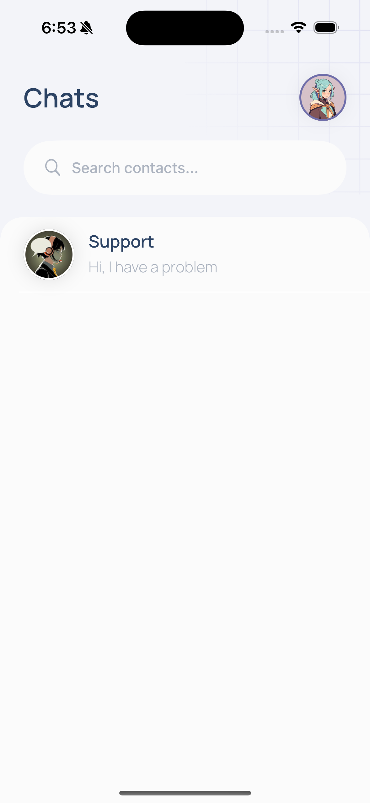
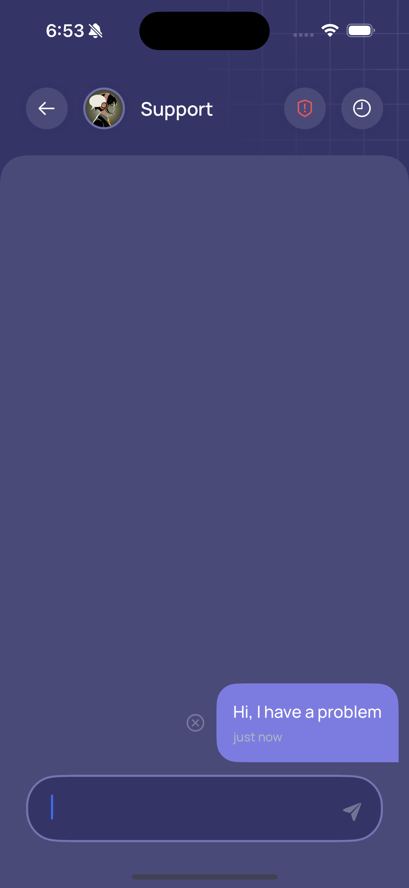
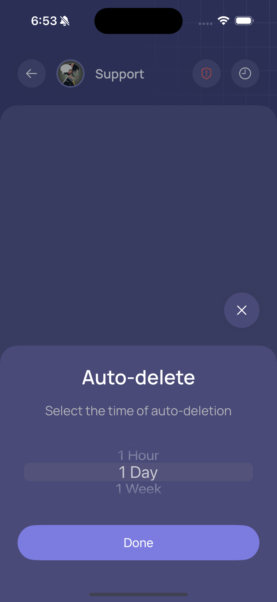
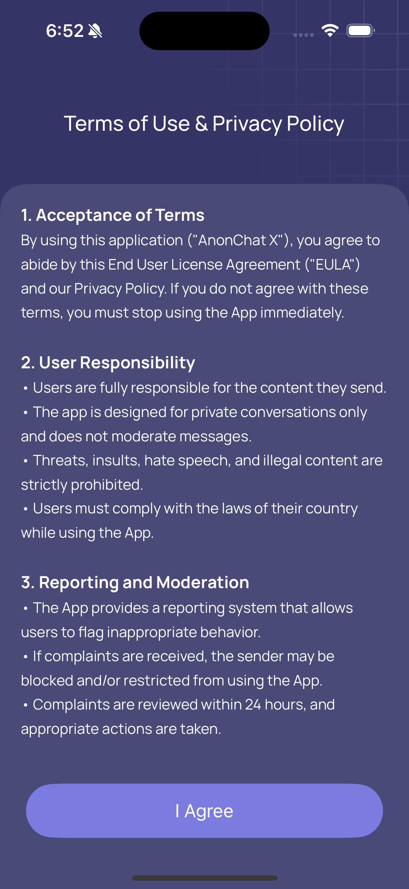
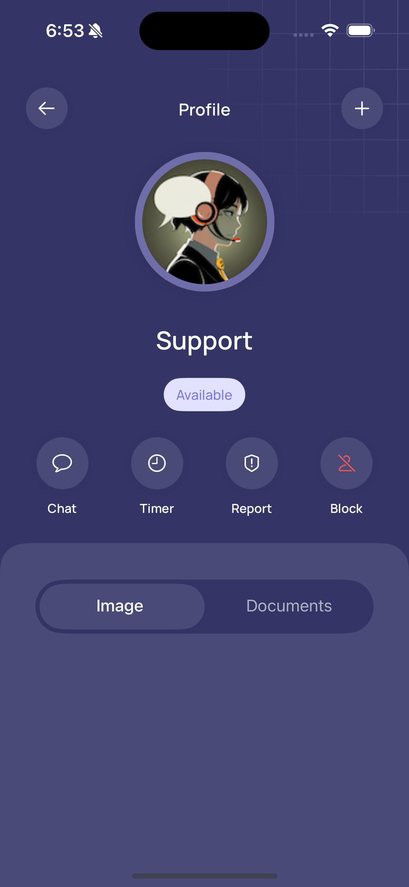
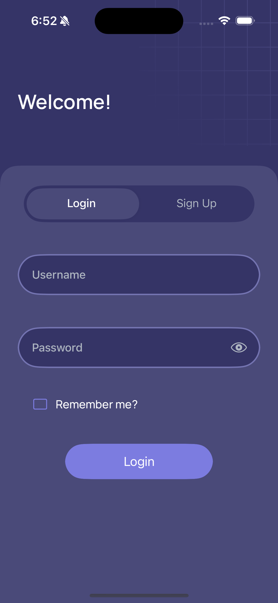
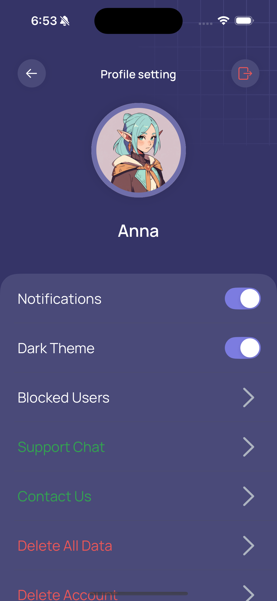
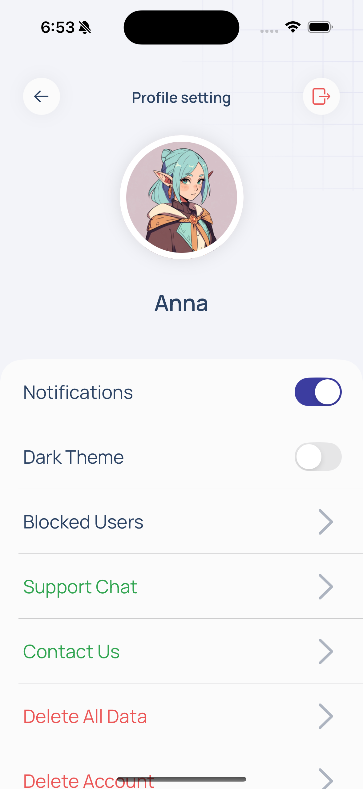

# 🕵️‍♂️ AnonChat X  

**AnonChat X** is an iOS application for **anonymous messaging**.  
This project was created as part of my iOS development learning journey and utilizes **Swift, UIKit, Firebase, and Realm**.  

---

## 🚀 Features  

✔️ User authentication and registration (Firebase)  
✔️ Send and receive anonymous messages (Firebace)
✔️ Data encryption (CryptoKit)  
✔️ Local data storage (Realm)  
✔️ Custom UI built with UIKit  

---

## 🛠️ Technologies Used  

- **Language**: Swift  
- **UI Framework**: UIKit  
- **Database**: Realm, UserDefaults
- **Backend**: Firebase (Authentication, Firestore, Realtime, Messaging, Functions)  
- **Security**: CryptoKit, Keychan
- **Architecture**: MVVM + Combine  

---

## 📸 Screenshots  

<div align="center">
	
	
	
	
	
	
	
	
	
	
</div>


---

## 🏗 Installation & Setup  

**1. Clone the repository:**  
```bash
git clone https://github.com/vitiukovich/Anon.git
cd Anon
```

**2. Firebase Configuration Missing**

Since the project uses Firebase for authentication and data storage, follow these steps to set up your own Firebase project:
	1.	Go to Firebase Console and create a new project.
	2.	In the Firebase dashboard, select “iOS app” and register it using your app’s Bundle Identifier (found in Xcode under Target → General → Bundle Identifier).
	3.	**Download the GoogleService-Info.plist file** after the setup is complete.
	4.	Drag and drop GoogleService-Info.plist into your Xcode project (inside the root folder).
	5.	Enable **Firestore Database, Firebase Realtime, Firebase Storage and Firebase Authentication**.

**3. Open the project in Xcode**

Since the project uses Swift Package Manager (SPM), simply open the .xcodeproj file:

```bash
open AnonChat.xcodeproj
```

**4. Install dependencies (Swift Package Manager)**

Xcode should automatically resolve all dependencies, but if something is missing, do the following:
	•	Go to File → Packages → Update to Latest Package Versions.
	•	If issues persist, try Reset Package Caches in the same menu.

**5. Run the project**

---

## 💡 Future Improvements
	•	Add files sender
	•	Add themes
  • Add groops 
  • Add calls

---

👤 [Vitiukovich]
📧 Email: [vitiukovich@icloud.com]
🔗 GitHub: [https://github.com/vitiukovich]
   
